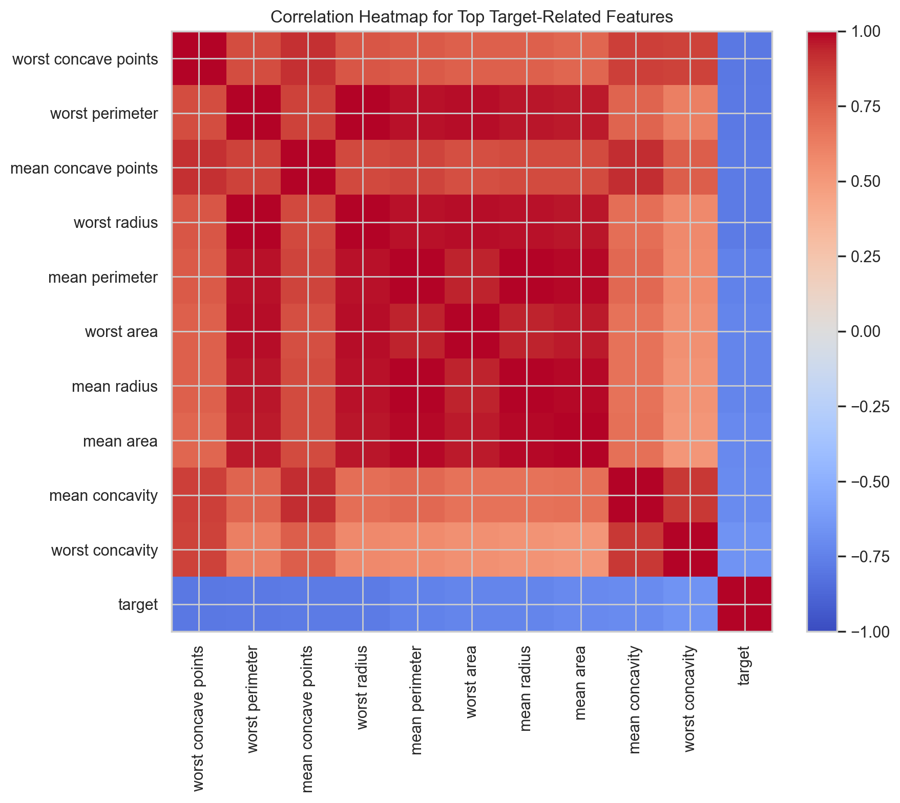
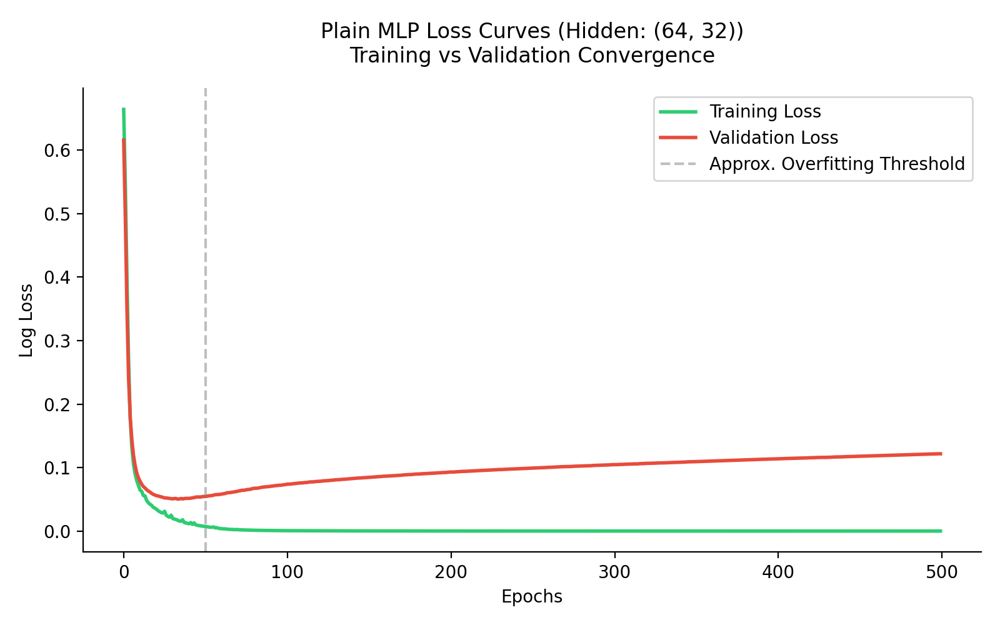
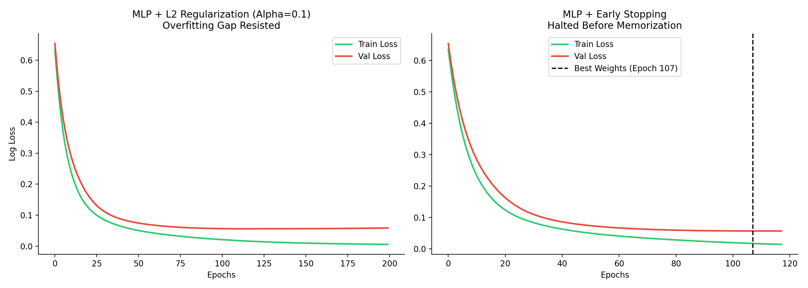

# Breast Cancer Diagnostic Pipeline: MLP Optimization & Regularization

A professional machine learning pipeline traversing from statistical baselines to optimized deep learning architectures using the **Breast Cancer Wisconsin (Diagnostic)** dataset.

---

## 🚀 Pipeline Overview

This project follows a 6-step curriculum-based approach to solve a clinical classification problem: **Malignant vs. Benign tumor detection.**

| Step | Focus | Technical Keypoint |
|:---:|---|---|
| **01** | **Data Engineering** | Stratified split, feature scaling, correlation analysis. |
| **02** | **Statistical Baseline** | Logistic Regression performance benchmark. |
| **03** | **Neural Foundation** | MLP architecture (30 → 64 → 32 → 1) with Overfitting diagnosis. |
| **04** | **Regularization** | L2 Weight Decay and **Early Stopping** (Peak Performance). |
| **05** | **Optimization** | Adam vs SGD shootout, Weight Init, and LR Schedules. |
| **06** | **Evaluation** | Final metric aggregation and comparative model analysis. |

---

## 📊 Technical Highlights

### 1. Data Understanding (Step 1)
We addressed **multicollinearity** (correlation > 0.90) and enforced a strict stratified 80/20 split to maintain class balance ($37\%$ Malignant / $63\%$ Benign).



### 2. Overfitting & Regularization (Step 3-4)
Our non-regularized (Plain) MLP initially demonstrated a significant **Overfitting Gap**. The peak performance was achieved in **Step 4** using **Early Stopping**, which effectively halted training before the model began memorizing noise.

````carousel

<!-- slide -->

````

### 3. Optimization Tuning (Step 5)
Benchmarking verified **Adam** as the superior optimizer for this feature set. We also analyzed **Initialization strategies**, observing that standard heuristics (He/Kaiming) are essential for deep signal propagation.

### 4. Critical Learning: Initialization Failure
Our analysis in Step 6 revealed that **Small Random Initialization (σ=0.01)** leads to a non-functional model (F1 ≈ 0). This occurs because weights are too small to break symmetry or overcome ReLU activation thresholds in multi-layer architectures, causing **vanishing gradients** and "neuron death."

---

## 🏆 Final Benchmark Results

Clinical priority: **Maximizing Recall** (minimizing missed tumors).

| Model | Step | Accuracy | Recall | F1-Score |
|---|:---:|:---:|:---:|:---:|
| **Logistic Regression** | 02 | $96.49\%$ | $95.81\%$ | $96.23\%$ |
| **Plain MLP** | 03 | $97.37\%$ | $97.43\%$ | $97.21\%$ |
| **MLP + Early Stopping** | 04 | **$98.25\%$** | **$98.13\%$** | **$98.13\%$** |

---

## 🛠 Repository Structure

*   `notebooks/`: Sequential pipeline steps (1-6).
*   `src/`: Core source code (data utilities and configs).
*   `outputs/`: High-resolution figures and CSV metrics.
*   `responsibilities/`: Team member roles and contribution reports.

## 📦 Requirements

```bash
pip install torch pandas numpy matplotlib seaborn scikit-learn
```

---
**Conclusion:** Through systematic regularization and optimization, the MLP architecture achieved a **+2.3% improvement in Recall** over the statistical baseline, proving the efficacy of neural feature extraction when properly constrained.
